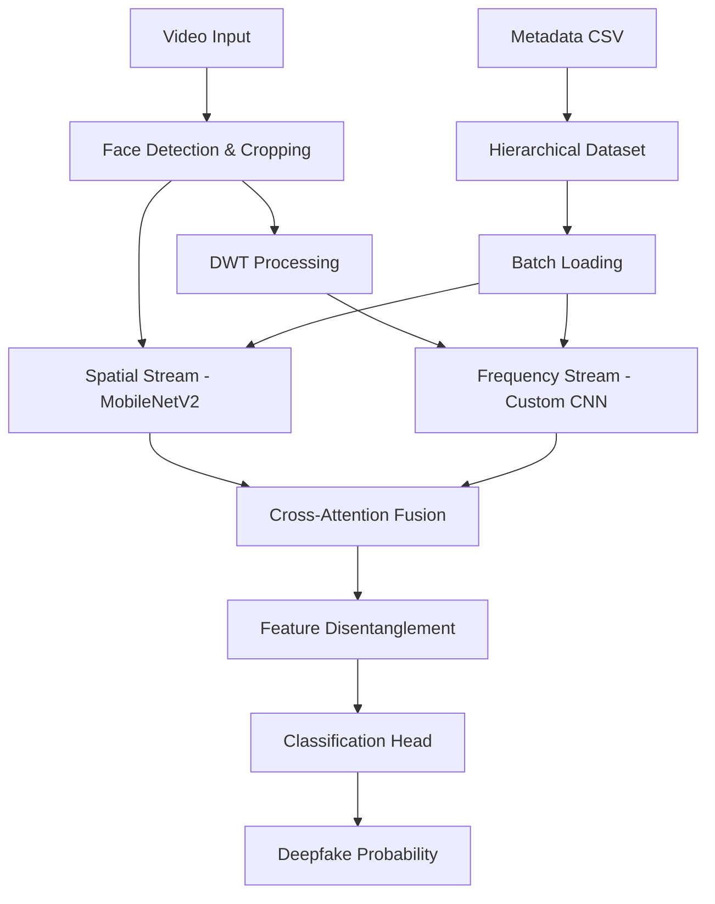

# CRAFT-DF Design Document

## Overview

CRAFT-DF implements a dual-stream neural network architecture that combines spatial and frequency domain analysis for robust deepfake detection. The system uses a file-based hierarchical database approach for scalable data management and PyTorch Lightning for modular, reproducible training. The architecture is specifically optimized for high-performance GPUs and designed to handle massive video datasets efficiently.

## Architecture

### High-Level System Architecture



### Dual-Stream Architecture Design

**Stream A (Spatial Domain):**
- Pre-trained MobileNetV2 backbone for efficient feature extraction
- Input: Face crops (224x224x3)
- Output: Spatial feature embeddings (1280-dimensional)
- Frozen initial layers, fine-tuned classification layers

**Stream B (Frequency Domain):**
- Custom DWT-based feature extractor
- Multi-level wavelet decomposition (3 levels using Daubechies wavelets)
- Frequency artifact detection through learned filters
- Input: DWT coefficients from face crops
- Output: Frequency feature embeddings (512-dimensional)

## Components and Interfaces

### 1. Data Processing Pipeline (`data_prep.py`)

```python
class VideoProcessor:
    def __init__(self, input_dir: str, output_dir: str, metadata_path: str)
    def extract_faces(self, video_path: str) -> List[np.ndarray]
    def apply_dwt(self, face_crop: np.ndarray) -> np.ndarray
    def process_video_batch(self, video_paths: List[str]) -> None
    def generate_metadata(self) -> pd.DataFrame
```

**Key Design Decisions:**
- OpenCV Haar cascades for face detection (more reliable than MediaPipe in this environment, faster than MTCNN)
- PyWavelets for DWT implementation with 'db4' wavelets
- Hierarchical file structure: `output_dir/real|fake/video_id/frame_xxx.npy`
- Metadata CSV includes: file_path, label, video_id, frame_number, face_confidence

### 2. Model Architecture (`model.py`)

```python
class CRAFTDFModel(pl.LightningModule):
    def __init__(self, num_classes: int = 2, spatial_dim: int = 1280, freq_dim: int = 512)
    def forward(self, spatial_input: torch.Tensor, freq_input: torch.Tensor) -> torch.Tensor
    
class SpatialStream(nn.Module):
    # MobileNetV2-based spatial feature extractor
    
class FrequencyStream(nn.Module):
    # DWT-based frequency feature extractor
    
class CrossAttentionFusion(nn.Module):
    # Multi-head cross-attention between spatial and frequency features
    
class FeatureDisentanglement(nn.Module):
    # Adversarial disentanglement for domain generalization
```

**Cross-Attention Mechanism:**
- Multi-head attention with 8 heads
- Spatial features as queries, frequency features as keys/values
- Residual connections and layer normalization
- Attention weights provide interpretability

### 3. Dataset Management (`dataset.py`)

```python
class HierarchicalDeepfakeDataset(Dataset):
    def __init__(self, metadata_path: str, transform: Optional[Callable] = None)
    def __getitem__(self, idx: int) -> Tuple[torch.Tensor, torch.Tensor, int]
    def __len__(self) -> int
    def get_class_weights(self) -> torch.Tensor
```

**Memory Optimization:**
- Lazy loading: Files loaded only when accessed
- Memory mapping for large .npy files
- Batch-wise caching with LRU eviction
- Configurable cache size based on available RAM

### 4. Training Pipeline (`train.py`)

```python
class TrainingPipeline:
    def __init__(self, config: Dict[str, Any])
    def setup_data_loaders(self) -> Tuple[DataLoader, DataLoader, DataLoader]
    def setup_model(self) -> CRAFTDFModel
    def setup_trainer(self) -> pl.Trainer
    def train(self) -> None
```

## Data Models

### Metadata Schema

```python
@dataclass
class VideoMetadata:
    file_path: str
    spatial_path: str
    frequency_path: str
    label: int  # 0: real, 1: fake
    video_id: str
    frame_number: int
    face_confidence: float
    processing_timestamp: datetime
    dwt_levels: int
    wavelet_type: str
```

### Model Configuration

```python
@dataclass
class ModelConfig:
    spatial_backbone: str = "mobilenet_v2"
    spatial_pretrained: bool = True
    spatial_freeze_layers: int = 10
    freq_dwt_levels: int = 3
    freq_wavelet: str = "db4"
    attention_heads: int = 8
    attention_dim: int = 512
    dropout_rate: float = 0.1
    learning_rate: float = 1e-4
    batch_size: int = 32
    max_epochs: int = 100
```

## Error Handling

### Data Processing Errors
- **Face Detection Failures:** Skip frames with no detected faces, log warnings
- **Video Corruption:** Implement robust video reading with fallback mechanisms
- **DWT Processing Errors:** Validate input dimensions, handle edge cases
- **File I/O Errors:** Retry mechanisms with exponential backoff

### Training Errors
- **GPU Memory Overflow:** Automatic batch size reduction with gradient accumulation
- **Convergence Issues:** Learning rate scheduling and early stopping
- **Checkpoint Corruption:** Multiple checkpoint saves with validation
- **Data Loading Errors:** Skip corrupted samples, maintain training stability

### Model Inference Errors
- **Input Validation:** Assert tensor shapes and data types
- **Memory Management:** Clear GPU cache between batches
- **Numerical Stability:** Gradient clipping and batch normalization

## Testing Strategy

### Unit Tests
- **Data Processing:** Test face detection, DWT computation, metadata generation
- **Model Components:** Test each stream independently, attention mechanisms
- **Dataset Loading:** Verify batch consistency, memory usage patterns
- **Utility Functions:** Test seed setting, configuration loading

### Integration Tests
- **End-to-End Pipeline:** Full training loop with synthetic data
- **Cross-Platform Compatibility:** Test on different GPU architectures
- **Memory Stress Tests:** Large dataset simulation, memory leak detection
- **Reproducibility Tests:** Verify deterministic behavior with fixed seeds

### Performance Tests
- **Throughput Benchmarks:** Measure samples/second on target hardware
- **Memory Profiling:** Track GPU and CPU memory usage patterns
- **Scalability Tests:** Performance with varying dataset sizes
- **Inference Speed:** Real-time processing capability assessment

### Validation Strategy
- **Cross-Dataset Evaluation:** Test generalization across different deepfake datasets
- **Ablation Studies:** Individual stream performance, attention contribution
- **Robustness Testing:** Performance under various video qualities and compression
- **Interpretability Analysis:** Attention weight visualization, feature importance

## Implementation Considerations

### GPU Optimization
- **Mixed Precision Training:** Use automatic mixed precision for H100 optimization
- **Tensor Core Utilization:** Ensure tensor dimensions are multiples of 8
- **Memory Coalescing:** Optimize data layout for efficient GPU memory access
- **Asynchronous Data Loading:** Overlap data loading with computation

### Scalability Features
- **Distributed Training:** Multi-GPU support through PyTorch Lightning
- **Gradient Checkpointing:** Trade computation for memory in large models
- **Dynamic Batching:** Adjust batch sizes based on available memory
- **Efficient Caching:** Smart caching strategies for frequently accessed data

### Reproducibility Measures
- **Deterministic Operations:** Set all random seeds, use deterministic algorithms
- **Version Pinning:** Lock dependency versions in requirements.txt
- **Configuration Management:** YAML-based configuration with validation
- **Experiment Tracking:** Comprehensive logging of hyperparameters and metrics